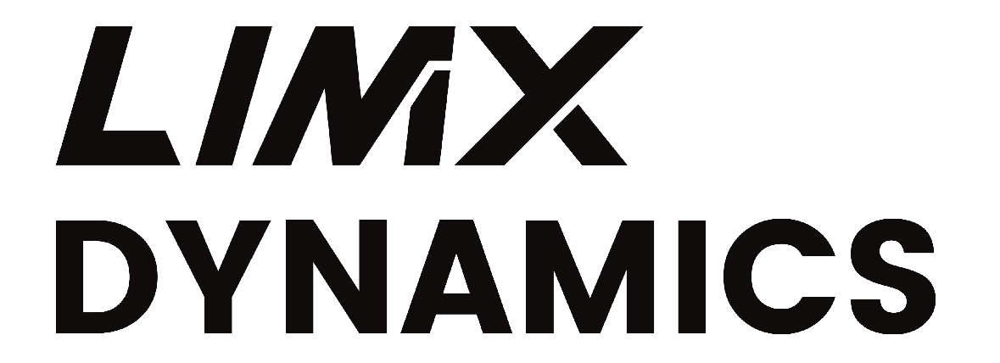

LimX Dynamics is a general-purpose robotics company, focusing on full-size humanoid robots and have developed innovative products such as biped and quadruped robots.

LimX Dynamics is dedicated to disruptive innovations by Embodied AI. The goal is to unleash the generalization of Artificial General Intelligence (AGI) in the physical world. Based on revolutionizing core software and hardware technologies, and building first-of-its-kind foundation model for humanoid robots, we aim to achieving loco-manipulation robotics platform and Embodied AI tool kits for innovators and integrators. We promote the widespread applications of Embodied AI across B2B & B2C sectors, including R&D, manufacturing, business and households services. 

<table><tbody>

    
    Open source projects 

<!-- <tr><td colspan="1" rowspan="4"> -->

<table class="table table-striped table-bordered table-vcenter"/>
    <tbody>
    <tr><th> Title </th> <th>Description</th> <th>Stars</th> <th>Forks</th></tr>
    <tr><td colspan="4" align="center"><b>The Tron1 Robot</b></td></tr>
    <tr>
        <td align="center" ><a href="https://github.com/limxdynamics/tutorial-docs"> tutorial-docs </a></td>
        <td> Stores technical guides for robot development, offering clear workflows and practical guidance. </td>
        <td></td>
        <td></td>
    </tr>
    <tr>
        <td align="center" ><a href="https://github.com/limxdynamics/robot-description"> robot-description </a></td>
        <td> Stores URDF and Xacro files for defining robot models, which are used in robotics simulations and robot control applications. </td>
        <td></td>
        <td></td>
    </tr>
    <tr>
        <td align="center" ><a href="https://github.com/limxdynamics/pointfoot-sdk-lowlevel"> tron1-sdk-lowlevel </a></td>
        <td> The Tron1 robot's motion control interface supports developing custom algorithms in <a href="https://www.ros.org"> ROS1/ROS2 </a> or non-ROS environments and offers C++/Python interfaces. </td>
        <td></td>
        <td></td>
    </tr>
    <tr>
        <td align="center" ><a href="https://github.com/limxdynamics/rl-deploy-ros-cpp"> rl-deploy-ros-cpp </a></td>
        <td> It is a reinforcement learning deployment framework based on <a href="https://www.ros.org"> ROS1 </a> that helps you quickly deploy your trained models. </td>
        <td></td>
        <td></td>
    </tr>
    <tr>
        <td align="center" ><a href="https://github.com/limxdynamics/rl-deploy-ros2-cpp"> rl-deploy-ros2-cpp </a></td>
        <td> It is a reinforcement learning deployment framework based on <a href="https://www.ros.org"> ROS2 </a> that helps you quickly deploy your trained models. </td>
        <td></td>
        <td></td>
    </tr>
    <tr>
        <td align="center" ><a href="https://github.com/limxdynamics/rl-deploy-with-python"> rl-deploy-with-python </a></td>
        <td> It is a reinforcement learning deployment algorithm that leverages Python to streamline the deployment of your trained models. </td>
        <td></td>
        <td></td>
    </tr>
    <tr>
        <td align="center" ><a href="https://github.com/limxdynamics/pointfoot-gazebo-ros"> tron1-gazebo-ros </a></td>
        <td> A <a href="https://www.ros.org"> ROS1-based </a> simulation tool for the Tron1 robot that supports quick Sim-to-Real validation and deployment of robot algorithms. </td>
        <td></td>
        <td></td>
    </tr>
    <tr>
        <td align="center" ><a href="https://github.com/limxdynamics/pointfoot-gazebo-ros2"> tron1-gazebo-ros2 </a></td>
        <td> A <a href="https://www.ros.org"> ROS2-based </a> simulation tool for the Tron1 robot that supports quick Sim-to-Real validation and deployment of robot algorithms. </td>
        <td></td>
        <td></td>
    </tr>
    <tr>
        <td align="center" ><a href="https://github.com/limxdynamics/pointfoot-mujoco-sim.git"> tron1-mujoco-sim </a></td>
        <td> A <a href="https://mujoco.org"> MuJoCo </a> simulation tool for the Tron1 robot that supports quick Sim-to-Real validation and deployment of robot algorithms. </td>
        <td></td>
        <td></td>
    </tr>
    <tr>
        <td align="center" ><a href="https://github.com/limxdynamics/pointfoot-legged-gym"> tron1-legged-gym </a></td>
        <td> A reinforcement learning training framework designed specifically for Tron1 robots, 
        providing comprehensive tools for simulation and training, and supporting reinforcement learning in various environments. </td>
        <td></td>
        <td></td>
    </tr>
    <tr>
        <td align="center" ><a href="https://github.com/limxdynamics/robot-visualization"> robot-visualization </a></td>
        <td> Provides a set of visualization and debugging tools suitable for both simulation and actual robot deployment. 
        These tools include <a href="https://wiki.ros.org/rviz"> RViz </a> and <a href="https://plotjuggler.io"> Plotjuggler </a> for intuitive data presentation. </td>
        <td></td>
        <td></td>
    </tr>
    <tr>
        <td align="center" ><a href="https://github.com/limxdynamics/pointfoot-sdk-highlevel"> tron1-sdk-highlevel </a></td>
        <td> A high-level application development interface for Tron1 robots, providing direct control over robot movements. 
        Through this interface, you can develop custom high-level application algorithms such as localization and navigation. </td>
        <td></td>
        <td></td>
    </tr>
    </tbody>
</table>
