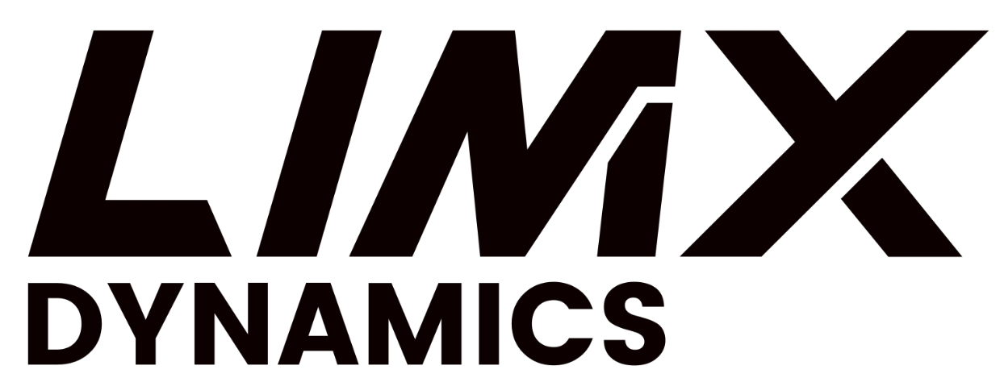

LimX Dynamics is a general-purpose robot company. We are devoted to the research, development, and manufacturing of general-purpose robots empowered by Embodied AI with a product lineup of humanoid robots, wheeled quadruped robots, biped robots as well as robotic software and hardware solutions. They are widely applied in sectors such as smart manufacturing, industrial inspections, logistics and distribution, special operations and household services catering to both B2B and B2C markets.

Since 2005, we have been collaborating with renowned scholars and authoritative institutions worldwide, conducting cutting-edge research in robotics, software algorithms, and AI.

Committed to disruptive innovation of robotics to address the key challenges in the industry, our achievement of general robot capable of all-terrain mobility and general mobile manipulation will unleash the true value of technology advancement to the society and break the human-robot boundaries to empower human beings. 

<table><tbody>

    
    Open source projects 

<!-- <tr><td colspan="1" rowspan="4"> -->

<table class="table table-striped table-bordered table-vcenter"/>
    <tbody>
    <tr><th> Title </th> <th>Description</th> <th>Stars</th> <th>Forks</th></tr>
    <tr>
        <td align="center" ><a href="https://github.com/limxdynamics/robot-description"> robot-description </a></td>
        <td> Stores URDF and Xacro files for defining robot models, which are used in robotics simulations and robot control applications. </td>
        <td></td>
        <td></td>
    </tr>
    <tr>
        <td align="center" ><a href="https://github.com/limxdynamics/pointfoot-sdk-lowlevel"> pointfoot-sdk-lowlevel </a></td>
        <td> The Pointfoot robot's motion control interface supports developing custom algorithms in ROS1/ROS2 or non-ROS environments and offers C++/Python interfaces. </td>
        <td></td>
        <td></td>
    </tr>
    <tr>
        <td align="center" ><a href="https://github.com/limxdynamics/rl-deploy-ros-cpp"> rl-deploy-ros-cpp </a></td>
        <td> It is a reinforcement learning deployment framework based on ROS1 that helps you quickly deploy your trained models. </td>
        <td></td>
        <td></td>
    </tr>
    <tr>
        <td align="center" ><a href="https://github.com/limxdynamics/rl-deploy-ros2-cpp"> rl-deploy-ros2-cpp </a></td>
        <td> It is a reinforcement learning deployment framework based on ROS2 that helps you quickly deploy your trained models. </td>
        <td></td>
        <td></td>
    </tr>
    <tr>
        <td align="center" ><a href="https://github.com/limxdynamics/pointfoot-gazebo-ros"> pointfoot-gazebo-ros </a></td>
        <td> A ROS1-based simulation tool for the Pointfoot robot that supports quick Sim-to-Real validation and deployment of robot algorithms. </td>
        <td></td>
        <td></td>
    </tr>
    <tr>
        <td align="center" ><a href="https://github.com/limxdynamics/pointfoot-gazebo-ros2"> pointfoot-gazebo-ros2 </a></td>
        <td> A ROS2-based simulation tool for the Pointfoot robot that supports quick Sim-to-Real validation and deployment of robot algorithms. </td>
        <td></td>
        <td></td>
    </tr>
    <tr>
        <td align="center" ><a href="https://github.com/limxdynamics/pointfoot-legged-gym"> pointfoot-legged-gym </a></td>
        <td> A reinforcement learning training framework designed specifically for PointFoot robots, 
        providing comprehensive tools for simulation and training, and supporting reinforcement learning in various environments. </td>
        <td></td>
        <td></td>
    </tr>
    
    </tbody>
</table>

