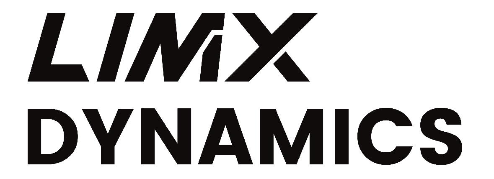

LimX Dynamics is a general-purpose robotics company, focusing on full-size humanoid robots and have developed innovative products such as biped and quadruped robots.

LimX Dynamics is dedicated to disruptive innovations by Embodied AI. The goal is to unleash the generalization of Artificial General Intelligence (AGI) in the physical world. Based on revolutionizing core software and hardware technologies, and building first-of-its-kind foundation model for humanoid robots, we aim to achieving loco-manipulation robotics platform and Embodied AI tool kits for innovators and integrators. We promote the widespread applications of Embodied AI across B2B & B2C sectors, including R&D, manufacturing, business and households services. 

<table><tbody>

    
    Open source projects 

<!-- <tr><td colspan="1" rowspan="4"> -->

<table class="table table-striped table-bordered table-vcenter"/>
    <tbody>
    <tr><th>Category</th><th> Title </th> <th>Description</th> <th>Stars</th> <th>Forks</th></tr>
    <tr>
        <td rowspan="6" class="font-weight-bold">Oli</td>
        <td align="center" ><a href="https://github.com/limxdynamics/humanoid-description"> humanoid-description </a></td>
        <td> Robot model files, including URDF, USD, and XML model files. Can be used for simulation, training, etc. </td>
        <td></td>
        <td></td>
    </tr>
    <tr>
        <td align="center" ><a href="https://github.com/limxdynamics/humanoid-mujoco-sim"> humanoid-mujoco-sim </a></td>
        <td> A <a href="https://mujoco.org"> MuJoCo </a> simulation tool for the Oli robot that supports quick Sim-to-Real validation and deployment of robot algorithms. </td>
        <td></td>
        <td></td>
    </tr>
    <tr>
        <td align="center" ><a href="https://github.com/limxdynamics/humanoid-rl-deploy-python"> humanoid-rl-deploy-python </a></td>
        <td> This is a Python-based reinforcement learning deployment algorithm that streamlines the process of deploying trained models on Oli robots. </td>
        <td></td>
        <td></td>
    </tr> 
    <tr>
        <td align="center" ><a href="https://github.com/limxdynamics/humanoid-rl-deploy-cpp"> humanoid-rl-deploy-cpp </a></td>
        <td> This is a lightweight algorithm framework implemented in standard C++. It enables rapid deployment of trained models when ROS1/ROS2 is not required. </td>
        <td></td>
        <td></td>
    </tr> 
    <tr>
        <td align="center" ><a href="https://github.com/limxdynamics/humanoid-rl-deploy-ros2"> humanoid-rl-deploy-ros2 </a></td>
        <td> This is a reinforcement learning deployment framework based on <a href="https://www.ros.org">ROS2</a> that enables rapid deployment of trained models on Oli robots. </td>
        <td></td>
        <td></td>
    </tr> 
    <tr>
        <td align="center" ><a href="https://github.com/limxdynamics/humanoid-rl-deploy-ros"> humanoid-rl-deploy-ros </a></td>
        <td> This is a reinforcement learning deployment framework based on <a href="https://www.ros.org">ROS1</a> that enables rapid deployment of trained models on Oli robots. </td>
        <td></td>
        <td></td>
    </tr>
    <tr>
        <td rowspan="8" class="font-weight-bold">TRON1</td>
        <td align="center" ><a href="https://github.com/limxdynamics/tron1-rl-isaaclab"> tron1-rl-isaaclab </a></td>
        <td> A reinforcement learning training framework designed specifically for Tron1 robots, 
        providing comprehensive tools for simulation and training, and supporting reinforcement learning in various environments. </td>
        <td></td>
        <td></td>
    </tr>
    <tr>
        <td align="center" ><a href="https://github.com/limxdynamics/tron1-rl-isaacgym"> tron1-rl-isaacgym </a></td>
        <td> A reinforcement learning training framework designed specifically for Tron1 robots, 
        providing comprehensive tools for simulation and training, and supporting reinforcement learning in various environments. </td>
        <td></td>
        <td></td>
    </tr>
     <tr>
        <td align="center" ><a href="https://github.com/limxdynamics/tron1-rl-deploy-ros"> tron1-rl-deploy-ros </a></td>
        <td> It is a reinforcement learning deployment framework based on <a href="https://www.ros.org"> ROS1 </a> that helps you quickly deploy your trained models. </td>
        <td></td>
        <td></td>
    </tr>
    <tr>
        <td align="center" ><a href="https://github.com/limxdynamics/tron1-rl-deploy-ros2"> tron1-rl-deploy-ros2 </a></td>
        <td> It is a reinforcement learning deployment framework based on <a href="https://www.ros.org"> ROS2 </a> that helps you quickly deploy your trained models. </td>
        <td></td>
        <td></td>
    </tr>
    <tr>
        <td align="center" ><a href="https://github.com/limxdynamics/tron1-rl-deploy-python"> tron1-rl-deploy-python </a></td>
        <td> It is a reinforcement learning deployment algorithm that leverages Python to streamline the deployment of your trained models. </td>
        <td></td>
        <td></td>
    </tr>
    <tr>
        <td align="center" ><a href="https://github.com/limxdynamics/tron1-gazebo-ros"> tron1-gazebo-ros </a></td>
        <td> A <a href="https://www.ros.org"> ROS1-based </a> simulation tool for the Tron1 robot that supports quick Sim-to-Real validation and deployment of robot algorithms. </td>
        <td></td>
        <td></td>
    </tr>
    <tr>
        <td align="center" ><a href="https://github.com/limxdynamics/tron1-gazebo-ros2"> tron1-gazebo-ros2 </a></td>
        <td> A <a href="https://www.ros.org"> ROS2-based </a> simulation tool for the Tron1 robot that supports quick Sim-to-Real validation and deployment of robot algorithms. </td>
        <td></td>
        <td></td>
    </tr>
    <tr>
        <td align="center" ><a href="https://github.com/limxdynamics/tron1-mujoco-sim.git"> tron1-mujoco-sim </a></td>
        <td> A <a href="https://mujoco.org"> MuJoCo </a> simulation tool for the Tron1 robot that supports quick Sim-to-Real validation and deployment of robot algorithms. </td>
        <td></td>
        <td></td>
    </tr>
    </tbody>
</table>
