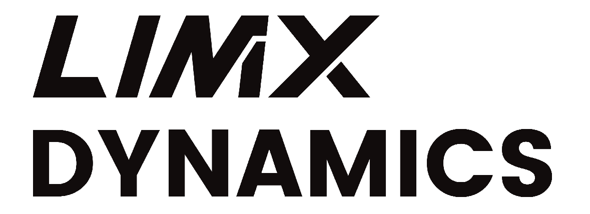

[English](README.md) | 中文

LimX Dynamics（逐际动力）是一家通用机器人公司，专注于全尺寸人形机器人，并已研发出双足、四足等系列创新产品。

LimX Dynamics 致力于以具身智能（Embodied AI）驱动颠覆式创新。我们的目标是让人工智能（AGI）的泛化能力在物理世界充分释放。基于革命性的核心软硬件技术，并为机器人构建首个基础模型（foundation model），我们希望为创新者与集成商提供可操作（loco-manipulation）的机器人平台与具身智能工具集，推动具身智能在 B2B 与 B2C 领域（包括研发、制造、商务与家庭服务）的广泛应用。

  <picture>
    <source media="(prefers-color-scheme: dark)" srcset="https://raw.githubusercontent.com/limxdynamics/limxdynamics/main/stars-dark.svg?v=202609040552">
    <source media="(prefers-color-scheme: light)" srcset="https://raw.githubusercontent.com/limxdynamics/limxdynamics/main/stars.svg?v=202609040552">
    
  </picture>

    
    开源项目

<!-- <tr><td colspan="1" rowspan="4"> -->

<table class="table table-striped table-bordered table-vcenter"/>
    <tbody>
    <tr><th>分类</th><th> 项目 </th> <th>描述</th> <th>Stars</th> <th>Forks</th></tr>
    <!-- 空的占位行用于让跨行分类单元格保持默认的白色条纹。 -->
    <tr></tr>
    <tr>
        <td rowspan="9" class="font-weight-bold">TRON2</td>
        <td align="center" ><a href="https://github.com/limxdynamics/tron2-robot-description"> robot-description </a></td>
        <td> TRON2 各型号的机器人模型文件，包括 URDF/xacro、MuJoCo XML、网格（mesh）以及可选的 USD 资源，用于仿真、可视化与下游工具。 </td>
        <td></td>
        <td></td>
    </tr>
    <tr>
        <td align="center" ><a href="https://github.com/limxdynamics/tron2_gazebo_ros"> tron2_gazebo_ros </a></td>
        <td> 面向 TRON2 机器人的 ROS Noetic 与 Gazebo 仿真工作区，支持控制器集成、Sim-to-Real 验证与部署流程。 </td>
        <td></td>
        <td></td>
    </tr>
    <tr>
        <td align="center" ><a href="https://github.com/limxdynamics/tron2_mujoco_sim"> tron2_mujoco_sim </a></td>
        <td> 面向 TRON2 机器人的 <a href="https://mujoco.org"> MuJoCo </a> 仿真工具，支持 SF/WF 机型，并通过 LimX SDK 完成控制器部署。 </td>
        <td></td>
        <td></td>
    </tr>
    <tr>
        <td align="center" ><a href="https://github.com/limxdynamics/tron2_rl_lab"> tron2_rl_lab </a></td>
        <td> 基于 <a href="https://isaac-sim.github.io/IsaacLab/"> Isaac Lab </a> 的 TRON2 强化学习训练栈，支持 SF/WF（脚式/轮式）变体。 </td>
        <td></td>
        <td></td>
    </tr>
    <tr>
        <td align="center" ><a href="https://github.com/limxdynamics/TRON2_YG_LAB"> TRON2_YG_LAB </a></td>
        <td> 面向 TRON2 的 Isaac Lab 强化学习训练栈，支持 6 自由度机械臂与夹爪变体，用于运动策略训练与演示。 </td>
        <td></td>
        <td></td>
    </tr>
    <tr>
        <td align="center" ><a href="https://github.com/limxdynamics/tron2_rl_deploy_python"> tron2_rl_deploy_python </a></td>
        <td> 面向 TRON2 的 Python 强化学习部署演示，可运行 ONNX 策略，并支持 MuJoCo 仿真与真机部署。 </td>
        <td></td>
        <td></td>
    </tr>
    <tr>
        <td align="center" ><a href="https://github.com/limxdynamics/tron2_rl_deploy_ros"> tron2_rl_deploy_ros </a></td>
        <td> 面向 TRON2 的 ROS Noetic 强化学习部署工作区，包含仿真与真机所需的硬件、控制器与 ONNX 运行时软件包。 </td>
        <td></td>
        <td></td>
    </tr>
    <tr>
        <td align="center" ><a href="https://github.com/limxdynamics/tron2_env"> tron2_env </a></td>
        <td> 面向 OpenPI 部署的公开 TRON2 运行时软件包，提供 WebSocket 机器人通信、动作执行、观测采集以及真机操作所需的 RTC 工具。 </td>
        <td></td>
        <td></td>
    </tr>
    <tr>
        <td align="center" ><a href="https://github.com/limxdynamics/tron2_openpi"> tron2_openpi </a></td>
        <td> 基于 OpenPI 衍生的 TRON2 部署版，新增 TRON2 策略变换、部署配置模板、pi0/pi0.5 策略服务与真机客户端示例。 </td>
        <td></td>
        <td></td>
    </tr>
    <tr></tr>
    <tr>
        <td rowspan="3" class="font-weight-bold">TronCamp</td>
        <td align="center" ><a href="https://github.com/limxdynamics/troncamp-mani"> troncamp-mani </a></td>
        <td> TronCamp ACT 4 任务参赛包 — 自包含软件包（Tron2 双臂 / RoboTwin / 单卡 ACT），包含环境搭建、入门示例与评分脚本，覆盖由易到难的四个操作任务。 </td>
        <td></td>
        <td></td>
    </tr>
    <tr>
        <td align="center" ><a href="https://github.com/limxdynamics/troncamp-web-mani"> troncamp-web-mani </a></td>
        <td> TronCamp 黑客松公开站点，提供任务说明、T1–T4 自主度阶梯、过程评估与匿名积分榜。 </td>
        <td></td>
        <td></td>
    </tr>
    <tr>
        <td align="center" ><a href="https://github.com/limxdynamics/troncamp-web-locomotion"> troncamp-web-locomotion </a></td>
        <td> TronCamp 运动（locomotion）赛道的网页配套站点，面向 TRON2 机器人。 </td>
        <td></td>
        <td></td>
    </tr>
    <tr></tr>
    <tr>
        <td rowspan="7" class="font-weight-bold">Oli</td>
        <td align="center" ><a href="https://github.com/limxdynamics/humanoid-description"> humanoid-description </a></td>
        <td> 机器人模型文件，包括 URDF、USD 与 XML 模型文件，可用于仿真、训练等。 </td>
        <td></td>
        <td></td>
    </tr>
    <tr>
        <td align="center" ><a href="https://github.com/limxdynamics/humanoid-mujoco-sim"> humanoid-mujoco-sim </a></td>
        <td> 面向 Oli 机器人的 <a href="https://mujoco.org"> MuJoCo </a> 仿真工具，支持快速的 Sim-to-Real 验证与机器人算法部署。 </td>
        <td></td>
        <td></td>
    </tr>
    <tr>
        <td align="center" ><a href="https://github.com/limxdynamics/humanoid-rl-isaaclab"> humanoid-rl-isaaclab </a></td>
        <td> 基于 <a href="https://isaac-sim.github.io/IsaacLab/"> Isaac Lab </a> 专为 Oli 人形机器人设计的强化学习训练框架，提供完整的仿真与训练工具，并支持 Sim-to-Real 运动部署。 </td>
        <td></td>
        <td></td>
    </tr>
    <tr>
        <td align="center" ><a href="https://github.com/limxdynamics/humanoid-rl-deploy-python"> humanoid-rl-deploy-python </a></td>
        <td> 基于 Python 的强化学习部署算法，简化在 Oli 机器人上部署已训练模型的过程。 </td>
        <td></td>
        <td></td>
    </tr>
    <tr>
        <td align="center" ><a href="https://github.com/limxdynamics/humanoid-rl-deploy-cpp"> humanoid-rl-deploy-cpp </a></td>
        <td> 轻量级 C++ 算法框架，在无需 ROS1/ROS2 时支持快速部署已训练模型。 </td>
        <td></td>
        <td></td>
    </tr>
    <tr>
        <td align="center" ><a href="https://github.com/limxdynamics/humanoid-rl-deploy-ros2"> humanoid-rl-deploy-ros2 </a></td>
        <td> 基于 <a href="https://www.ros.org">ROS2</a> 的强化学习部署框架，支持在 Oli 机器人上快速部署已训练模型。 </td>
        <td></td>
        <td></td>
    </tr>
    <tr>
        <td align="center" ><a href="https://github.com/limxdynamics/humanoid-rl-deploy-ros"> humanoid-rl-deploy-ros </a></td>
        <td> 基于 <a href="https://www.ros.org">ROS1</a> 的强化学习部署框架，支持在 Oli 机器人上快速部署已训练模型。 </td>
        <td></td>
        <td></td>
    </tr>
    <tr>
        <td rowspan="12" class="font-weight-bold">TRON1</td>
        <td align="center" ><a href="https://github.com/limxdynamics/tron1-robot-description"> robot-description </a></td>
        <td> TRON1 各型号的机器人模型文件，包括 URDF/xacro、MuJoCo XML 与网格文件，适用于点足与轮腿机器人。 </td>
        <td></td>
        <td></td>
    </tr>
    <tr>
        <td align="center" ><a href="https://github.com/limxdynamics/tron1-gazebo-ros"> tron1-gazebo-ros </a></td>
        <td> 基于 <a href="https://www.ros.org"> ROS1 </a> 的 TRON1 仿真工具，支持快速的 Sim-to-Real 验证与机器人算法部署。 </td>
        <td></td>
        <td></td>
    </tr>
    <tr>
        <td align="center" ><a href="https://github.com/limxdynamics/tron1-gazebo-ros2"> tron1-gazebo-ros2 </a></td>
        <td> 基于 <a href="https://www.ros.org"> ROS2 </a> 的 TRON1 仿真工具，支持快速的 Sim-to-Real 验证与机器人算法部署。 </td>
        <td></td>
        <td></td>
    </tr>
    <tr>
        <td align="center" ><a href="https://github.com/limxdynamics/tron1-mujoco-sim"> tron1-mujoco-sim </a></td>
        <td> 基于 <a href="https://mujoco.org"> MuJoCo </a> 的 TRON1 仿真工具，支持快速的 Sim-to-Real 验证与机器人算法部署。 </td>
        <td></td>
        <td></td>
    </tr>
    <tr>
        <td align="center" ><a href="https://github.com/limxdynamics/tron1-rl-isaaclab"> tron1-rl-isaaclab </a></td>
        <td> 基于 <a href="https://isaac-sim.github.io/IsaacLab/"> Isaac Lab </a> 专为 TRON1 设计的强化学习训练框架，提供完整的仿真与训练工具，并支持在多种环境中进行强化学习。 </td>
        <td></td>
        <td></td>
    </tr>
    <tr>
        <td align="center" ><a href="https://github.com/limxdynamics/tron1-rl-isaacgym"> tron1-rl-isaacgym </a></td>
        <td> 基于 <a href="https://developer.nvidia.com/isaac-gym"> Isaac Gym </a> 专为 TRON1 设计的强化学习训练框架，提供完整的仿真与训练工具，并支持在多种环境中进行强化学习。 </td>
        <td></td>
        <td></td>
    </tr>
    <tr>
        <td align="center" ><a href="https://github.com/limxdynamics/tron1-rl-deploy-ros"> tron1-rl-deploy-ros </a></td>
        <td> 基于 <a href="https://www.ros.org"> ROS1 </a> 的强化学习部署框架，帮助您快速部署训练好的模型。 </td>
        <td></td>
        <td></td>
    </tr>
    <tr>
        <td align="center" ><a href="https://github.com/limxdynamics/tron1-rl-deploy-ros2"> tron1-rl-deploy-ros2 </a></td>
        <td> 基于 <a href="https://www.ros.org"> ROS2 </a> 的强化学习部署框架，帮助您快速部署训练好的模型。 </td>
        <td></td>
        <td></td>
    </tr>
    <tr>
        <td align="center" ><a href="https://github.com/limxdynamics/tron1-rl-deploy-python"> tron1-rl-deploy-python </a></td>
        <td> 基于 Python 的强化学习部署算法，帮助您简化训练模型的部署流程。 </td>
        <td></td>
        <td></td>
    </tr>
    <tr>
        <td align="center" ><a href="https://github.com/limxdynamics/tron1-rl-deploy-arm"> tron1-rl-deploy-arm </a></td>
        <td> 基于 ONNX runtime 的 TRON1 机械臂控制器强化学习部署框架。 </td>
        <td></td>
        <td></td>
    </tr>
    <tr>
        <td align="center" ><a href="https://github.com/limxdynamics/tron1-ss"> tron1-ss </a></td>
        <td> 基于 ROS Noetic 的 TRON1 SLAM 与自主导航栈，支持激光雷达建图、定位与路径规划。 </td>
        <td></td>
        <td></td>
    </tr>
    <tr>
        <td align="center" ><a href="https://github.com/limxdynamics/tron1-agent"> tron1-agent </a></td>
        <td> 面向 Tron 机器人的实时语音交互智能体，具备基于 LLM 的对话、语音识别（FunASR）、TTS、工具调用与任务管理能力。 </td>
        <td></td>
        <td></td>
    </tr>
    <tr></tr>
    <tr>
        <td rowspan="3" class="font-weight-bold">VLA</td>
        <td align="center" ><a href="https://github.com/FluxVLA/FluxVLA"> FluxVLA </a></td>
        <td> 面向具身智能的一体化 VLA 工程平台 — 从数据采集到真机部署。 </td>
        <td></td>
        <td></td>
    </tr>
    <tr>
        <td align="center" ><a href="https://github.com/FluxVLA/FluxBisim"> FluxBisim </a></td>
        <td> 基于 IsaacSim 的 FluxVLA 双臂操作仿真平台。 </td>
        <td></td>
        <td></td>
    </tr>
    <tr>
        <td align="center" ><a href="https://github.com/FluxVLA/FluxDAgger"> FluxDAgger </a></td>
        <td> 面向双臂操作的模型解耦 DAgger 流水线 — 通过人在回路进行数据采集，兼容任意 VLA 与奖励模型。 </td>
        <td></td>
        <td></td>
    </tr>
    <tr>
        <td rowspan="7" class="font-weight-bold">SDK &amp; 工具</td>
        <td align="center" ><a href="https://github.com/limxdynamics/limxsdk-lowlevel"> limxsdk-lowlevel </a></td>
        <td> 用于直接与机器人通信（电机、传感器、实时控制）的低层 SDK，供上述仿真与部署仓库使用。 </td>
        <td></td>
        <td></td>
    </tr>
    <tr>
        <td align="center" ><a href="https://github.com/limxdynamics/robot-visualization"> robot-visualization </a></td>
        <td> 通过 RViz/PlotJuggler 实时可视化机器人关节状态、IMU、力传感器与运动轨迹。 </td>
        <td></td>
        <td></td>
    </tr>
    <tr>
        <td align="center" ><a href="https://github.com/limxdynamics/ros1-bridger"> ros1-bridger </a></td>
        <td> ROS1 通信桥（x86_64 与 aarch64，Noetic），用于将开发机接入 LimX 机器人网络。 </td>
        <td></td>
        <td></td>
    </tr>
    <tr>
        <td align="center" ><a href="https://github.com/limxdynamics/ros2-bridger"> ros2-bridger </a></td>
        <td> ROS2 通信桥（x86_64 与 aarch64，Foxy/Humble/Jazzy），用于将开发机接入 LimX 机器人网络。 </td>
        <td></td>
        <td></td>
    </tr>
    <tr>
        <td align="center" ><a href="https://github.com/limxdynamics/robot-joystick"> robot-joystick </a></td>
        <td> 面向仿真与真机手动控制的跨平台虚拟摇杆。 </td>
        <td></td>
        <td></td>
    </tr>
    <tr>
        <td align="center" ><a href="https://github.com/limxdynamics/limx-cli"> limx-cli </a></td>
        <td> 面向 LimX 机器人的 CLI 工具与 Scratch 可视化编程桥，支持 JSON 输出以对接 AI 智能体。 </td>
        <td></td>
        <td></td>
    </tr>
    <tr>
        <td align="center" ><a href="https://github.com/limxdynamics/gradmotion-cli"> gradmotion-cli </a></td>
        <td> 面向 LimX 机器人的 GradMotion 全身运动生成 CLI 工具，支持对接 AI 智能体。 </td>
        <td></td>
        <td></td>
    </tr>
    </tbody>
</table>